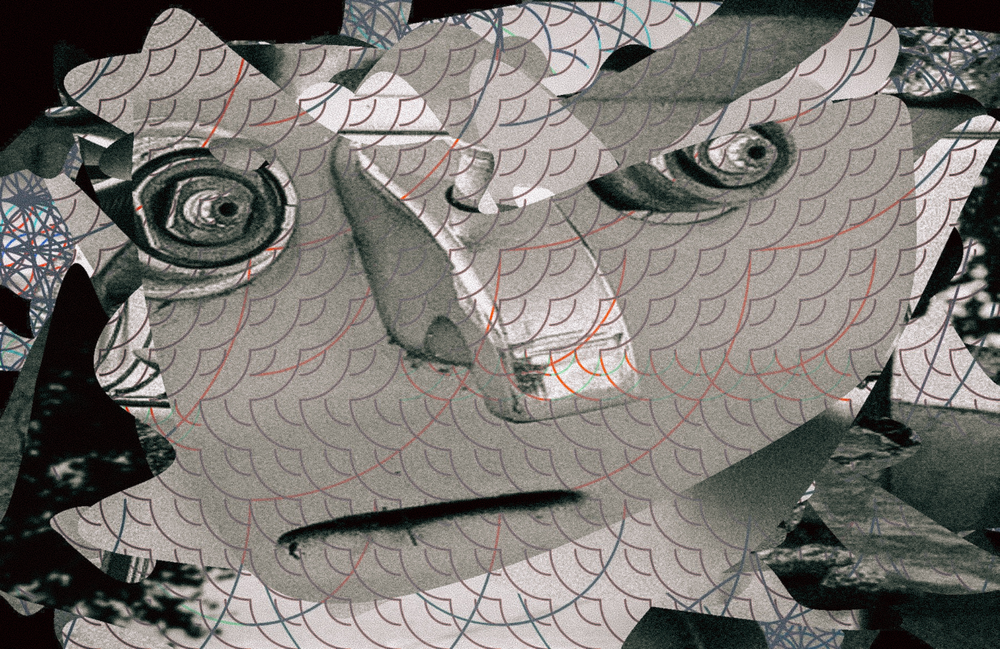

# Paredolia-GridSystem Visuals
this Code displays colages of images

## generate AlphaMasks
just comment out everything but the generateMasks(); function in draw().

You have some setting parameters in the "image/mask Variables" section to play around with.

I suggest keeping an eye on the out folder during the runtime and ending the program when enough masks have been generated.
Alternatively, you can of course use a for loop to generate a certain number of masks.
The generated masks are needed to finally create the collages.
Then comment out the generateMasks(); function and activate the other code in draw() again.
  
  
## make the Collages
collage with curved alpha masks that are randomly generated

put the images you want to use for the collages in the data folder of the processing sketch with the correct naming convention:
img_0.jpg, img_1.jpg, img_2.jpg, ...
same for masks mask_0.jpg, ...

When you start the program, a new collage should be displayed every 4 frames.
If you want to save the collages at the same time, activate the line in draw() with "saveFrame("data/out/outVid####.jpg");".

You also have some setting parameters in the "gridsystem Variables" section to play around with.
   
**Have Fun!**
